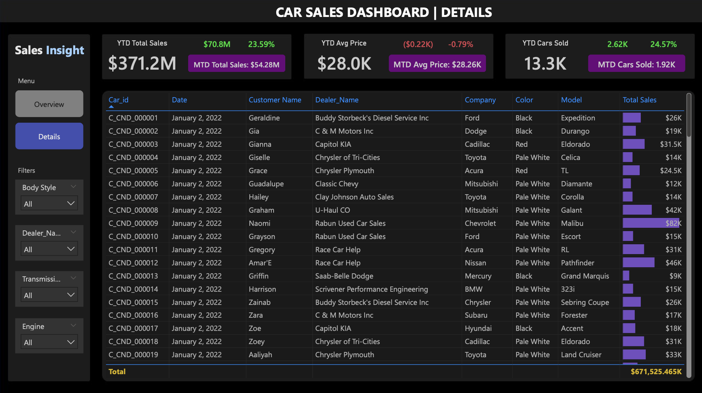

# 📊 Car Sales Dashboard (Power BI)

  
  &nbsp;&nbsp;&nbsp;&nbsp;
  

## 📌 Overview
This project presents an interactive Car Sales Performance Dashboard built in Power BI, designed to analyze sales trends, pricing behavior, and dealer performance across regions, vehicle attributes, and time. 
The dashboard enables stakeholders to quickly evaluate year-to-date (YTD) and month-to-date (MTD) performance, identify high-performing segments, and drill into transaction-level details for deeper analysis.

## 🧠 Business Questions Addressed
- How are **total sales, average price, and units sold** trending YTD and MTD?
- Which **companies and dealer regions** contribute most to revenue?
- How do **vehicle attributes** (body style, color, transmission, engine type) affect sales performance?
- Are there **seasonal or weekly sales patterns**?
- Which dealers or transactions require deeper investigation?

## 📈 Key Metrics Tracked
- **YTD Total Sales**
- **YTD Cars Sold**
- **YTD Average Price**
- **MTD vs YTD variance (%)**
- **% of Grand Total Sales by Company**
- Weekly sales trends
- Sales by body style, color, and region

## 🎥 Dashboard Walkthrough

## 🔍 Actionable Insights from the Analysis
- **Revenue concentration**: A small subset of companies contributes a disproportionately high share of YTD sales, indicating opportunities for targeted partnerships or risk diversification.
- **Pricing stability**: Despite fluctuations in monthly volume, **average vehicle prices remain relatively stable**, suggesting consistent pricing strategies across dealers.
- **Product mix impact**: Certain body styles (e.g., SUVs and Sedans) dominate total revenue, highlighting customer preference trends that can inform inventory planning.
- **Regional performance gaps**: Dealer regions show uneven sales contribution, signaling where marketing spend or dealer support could be optimized.
- **Sales volatility**: Weekly trend analysis reveals revenue spikes and dips, useful for demand forecasting and staffing or promotional planning.

## 🛠 Tools & Technologies
- **Power BI Desktop**
- **DAX**
  - `TOTALYTD`, `MTD`, `% of Grand Total`
  - Custom measures for KPI comparison
- **Power Query** for data shaping
- Conditional formatting (data bars)
- Custom navigation buttons
- Interactive slicers & filters
- Dark-theme dashboard design for readability

## 📊 Dataset
- Publicly available car sales *[dataset](https://drive.google.com/drive/folders/1h6RQTGkoMOqovVUh9qf_nX5bI1_Meg8w)*
- Data includes transactional sales records with vehicle, dealer, and customer attributes

## 📬 Feedback & Next Steps
This project was created as part of a data analytics portfolio.  
Suggestions, feedback, or discussion are always welcome.
